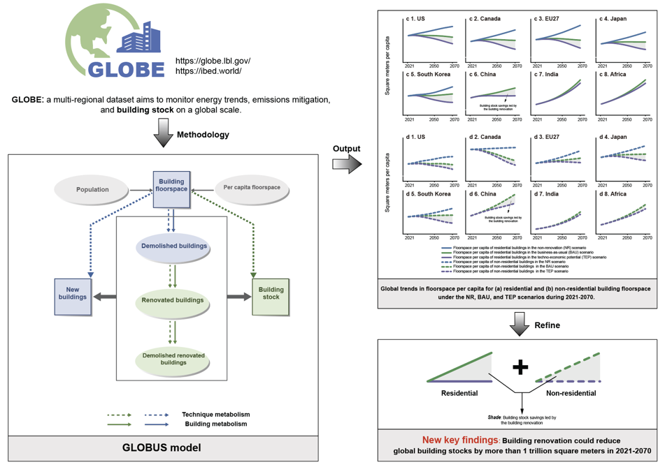

<script type="text/javascript" src="2html/jquery-3.3.1.min.js"></script>
<script type="text/javascript" src="2html/2html.js"></script>
<link rel="stylesheet" type="text/css" href="2html/style.css">

# **GLOBE**

Global Building Emissions (GLOBE) Database 

A multi-regional dataset aims to monitor energy trends, emissions mitigation, and building stock on a global scale.

GLOBE was initially proposed by [Dr. Minda Ma](https://buildings.lbl.gov/people/minda-ma) in 2021, and now it is a project led by [Lawrence Berkeley National Laboratory](https://buildings.lbl.gov/)(LBNL, operated by UC Berkeley for U.S. DOE), [Tsinghua University](https://www.tsinghua.edu.cn), and [Chongqing University](https://www.cqu.edu.cn).

<div align=left> </div> 
Global Building Emissions (**GLOBE**) Database (https://globe.lbl.gov/, also known as the second generation of **IBED**: https://ibed.world/)


## About GLOBE                                                                                                                                                                                                                                                                                                                                                                                                                                                                                                                                                                                                                                                                                

We are pleased to announce the release of a public version of our dataset, which is accessible at [http://ibed.world](http://ibed.world/). Our dataset is established based on the IEA database, which has clear distinctions between the end uses relevant to residential and commercial energy activities in its energy balance sheet.

To ensure the reliability of our database, we used the [IEA dataset](https://www.iea.org/data-and-statistics) as the primary reference to compile comprehensive and trustworthy data tables for each carbon-emitting country. For major emitters such as [China](https://doi.org/10.1016/j.enconman.2019.111915), [the United States](https://www.sciencedirect.com/science/article/pii/S2542435119303575), and [India](https://doi.org/10.1016/j.apenergy.2019.01.065), we accounted for and calibrated the building energy consumption data and the corresponding carbon emissions data based on the baseline dataset. For other carbon-emitting countries, we collected, cleaned, and validated survey reports and statistical results from regional governments and research institutions, which were then integrated with the baseline dataset to build a unified and standardized database.


## Publications of GLOBE

In 2023, some of GLOBE's noteworthy applications have been featured in international journals like *Advances in Applied Energy*, *Applied Energy*, and *Sustainable Cities and Society*.
[1] Xiang X, Zhou N, Ma M\*, Feng W, Yan R. Global transition of operational carbon in residential buildings since the millennium. *Advances in Applied Energy* 2023;11:100145.
[2] Yan R, Ma M\*, Zhou N, Feng W, Xiang X, Mao C. Towards COP27: Decarbonization patterns of residential building in China and India. *Applied Energy* 2023;352:122003.
[3] Yan R, Chen M, Xiang X, Feng W, Ma M\*. Heterogeneity or illusion? Track the carbon Kuznets curve of global residential building operations. *Applied Energy* 2023;347:121441.
[4] Zhang S, Zhou N, Feng W, Ma M\*, Xiang X, You K. Pathway for decarbonizing residential building operations in the US and China beyond the mid-century. *Applied Energy* 2023;342:121164.
[5] Chen L, Ma M\*, Xiang X. Decarbonizing or illusion? How carbon emissions of commercial building operations change worldwide. *Sustainable Cities and Society* 2023;96:104654.
[6] Xiang X, Ma M\*, Ma X, Chen L, Cai W, Feng W, et al. Historical decarbonization of global commercial building operations in the 21st century. *Applied Energy* 2022;322:119401.
[7] Zhang S, Ma M*, Xiang X, Cai W, Feng W, Ma Z. Potential to decarbonize the commercial building operation of the top two emitters by 2060. *Resources, Conservation and Recycling* 2022;185:106481.


<center>
    
    <br>
    <div style="color:orange; border-bottom: 1px solid #d9d9d9;
    display: inline-block;
    color: #999;
    padding: 2px;">Source: https://doi.org/10.1016/j.adapen.2023.100145</div>
</center>


<center>
    
    <br>
    <div style="color:orange; border-bottom: 1px solid #d9d9d9;
    display: inline-block;
    color: #999;
    padding: 2px;">Source: https://doi.org/10.1016/j.apenergy.2023.122003</div>
</center>


<center>
    
    <br>
    <div style="color:orange; border-bottom: 1px solid #d9d9d9;
    display: inline-block;
    color: #999;
    padding: 2px;">Source: https://doi.org/10.1016/j.adapen.2023.100145</div>
</center>


<center>
    
    <br>
    <div style="color:orange; border-bottom: 1px solid #d9d9d9;
    display: inline-block;
    color: #999;
    padding: 2px;">Source: https://doi.org/10.1016/j.apenergy.2023.121441</div>
</center>


## Carbon emissions of residential building operations 

| Regions                                                     | Name                                | Abbreviations | Unit            | 2000   | 2010   | 2020  |
| ----------------------------------------------------------- | ----------------------------------- | ------------- | --------------- | ------ | ------ | ----- |
| Europe & New Zealand                                        | Carbon  emissions                   | $C$           | $\text{MtCO}_2$ | 1089.5 | 1086.1 | 802.2 |
| Europe & New Zealand                                        | Share  of residential space heating | $C_{RSH}$     | $\%$            | 50.3%  | 50.8%  | 49.8% |
| Europe & New Zealand                                        | Share  of residential space cooling | $C_{RSC}$     | $\%$            | 2.3%   | 2.1%   | 2.3%  |
| Europe & New Zealand                                        | Share  of other end uses            | $C_{RA}$      | $\%$            | 47.4%  | 47.1%  | 47.9% |
| South America (Brazil, Colombia, Argentina, Chile, Uruguay) | Carbon  emissions                   | $C$           | $\text{MtCO}_2$ | 63.2   | 82.5   | 102.4 |
| South America (Brazil, Colombia, Argentina, Chile, Uruguay) | Share  of residential space heating | $C_{RSH}$     | $\%$            | 17.2%  | 18.3%  | 17.8% |
| South America (Brazil, Colombia, Argentina, Chile, Uruguay) | Share  of residential space cooling | $C_{RSC}$     | $\%$            | 3.2%   | 6.7%   | 9.8%  |
| South America (Brazil, Colombia, Argentina, Chile, Uruguay) | Share  of other end uses            | $C_{RA}$      | $\%$            | 79.6%  | 75.0%  | 72.4% |
| China                                                       | Carbon  emissions                   | $C$           | $\text{MtCO}_2$ | 412.9  | 690.7  | 803.4 |
| China                                                       | Share  of residential space heating | $C_{RSH}$     | $\%$            | 43.0%  | 43.4%  | 36.1% |
| China                                                       | Share  of residential space cooling | $C_{RSC}$     | $\%$            | 6.2%   | 6.1%   | 11.3% |
| China                                                       | Share  of other end uses            | $C_{RA}$      | $\%$            | 50.9%  | 50.5%  | 52.5% |
| India                                                       | Carbon emissions                    | $C$           | $\text{MtCO}_2$ | 157.5  | 248.2  | 375   |
| India                                                       | Share of residential space  heating | $C_{RSH}$     | $\%$            | 0.0%   | 0.0%   | 0.0%  |
| India                                                       | Share of residential space  cooling | $C_{RSC}$     | $\%$            | 22.5%  | 29.7%  | 36.4% |
| India                                                       | Share of other end uses             | $C_{RA}$      | $\%$            | 77.5%  | 70.3%  | 63.6% |
| Northeast Asia (Japan, Korea)                               | Carbon  emissions                   | $C$           | $\text{MtCO}_2$ | 239.9  | 285.5  | 281.6 |
| Northeast Asia (Japan, Korea)                               | Share  of residential space heating | $C_{RSH}$     | $\%$            | 29.2%  | 29.6%  | 26.7% |
| Northeast Asia (Japan, Korea)                               | Share  of residential space cooling | $C_{RSC}$     | $\%$            | 3.4%   | 4.0%   | 3.2%  |
| Northeast Asia (Japan, Korea)                               | Share  of other end uses            | $C_{RA}$      | $\%$            | 67.4%  | 66.4%  | 70.0% |
| Africa (South Africa, Morocco)                              | Carbon  emissions                   | $C$           | $\text{MtCO}_2$ | 41     | 66.1   | 88.2  |
| Africa (South Africa, Morocco)                              | Share  of residential space heating | $C_{RSH}$     | $\%$            | 14.4%  | 14.2%  | 13.8% |
| Africa (South Africa, Morocco)                              | Share  of residential space cooling | $C_{RSC}$     | $\%$            | 14.3%  | 14.2%  | 13.7% |
| Africa (South Africa, Morocco)                              | Share  of other end uses            | $C_{RA}$      | $\%$            | 71.3%  | 71.7%  | 72.5% |
| North America                                               | Carbon emissions                    | $C$           | $\text{MtCO}_2$ | 1289   | 1267.8 | 969.2 |
| North America                                               | Share of  residential space heating | $C_{RSH}$     | $\%$            | 37.9%  | 31.0%  | 36.1% |
| North America                                               | Share of  residential space cooling | $C_{RSC}$     | $\%$            | 7.9%   | 10.4%  | 9.6%  |
| North America                                               | Share of other end  uses            | $C_{RA}$      | $\%$            | 54.3%  | 58.6%  | 54.3% |
| Australia                                                   | Carbon  emissions                   | $C$           | $\text{MtCO}_2$ | 54.9   | 67.8   | 54.8  |
| Australia                                                   | Share  of residential space heating | $C_{RSH}$     | $\%$            | 14.5%  | 14.8%  | 17.3% |
| Australia                                                   | Share  of residential space cooling | $C_{RSC}$     | $\%$            | 5.2%   | 7.3%   | 8.2%  |
| Australia                                                   | Share  of other end uses            | $C_{RA}$      | $\%$            | 80.3%  | 77.9%  | 74.6% |


## Energy consumption of residential building operations 

| Regions                                                     | Name                                | Abbreviations | Unit                     | 2000     | 2010     | 2020     |
| ----------------------------------------------------------- | ----------------------------------- | ------------- | ------------------------ | -------- | -------- | -------- |
| Europe & New Zealand                                        | Energy  consumption                 | $E$           | Peta joule $(\text{PJ})$ | 15047.47 | 16564.21 | 14579.32 |
| Europe & New Zealand                                        | Share  of residential space heating | $E_{RSH}$     | $\%$                     | 62.3%    | 61.6%    | 57.2%    |
| Europe & New Zealand                                        | Share  of residential space cooling | $E_{RSC}$     | $\%$                     | 1.9%     | 1.9%     | 2.0%     |
| Europe & New Zealand                                        | Share  of other end uses            | $E_{RA}$      | $\%$                     | 35.8%    | 36.4%    | 40.8%    |
| South America (Brazil, Colombia, Argentina, Chile, Uruguay) | Energy  consumption                 | $E$           | Peta joule $(\text{PJ})$ | 1668.4   | 2001.8   | 2326.2   |
| South America (Brazil, Colombia, Argentina, Chile, Uruguay) | Share  of residential space heating | $E_{RSH}$     | $\%$                     | 13.4%    | 14.7%    | 14.9%    |
| South America (Brazil, Colombia, Argentina, Chile, Uruguay) | Share  of residential space cooling | $E_{RSC}$     | $\%$                     | 5.5%     | 7.5%     | 9.7%     |
| South America (Brazil, Colombia, Argentina, Chile, Uruguay) | Share  of other end uses            | $E_{RA}$      | $\%$                     | 81.2%    | 77.9%    | 75.3%    |
| China                                                       | Energy  consumption                 | $E$           | Peta joule $(\text{PJ})$ | 5157.2   | 11614.6  | 19192.9  |
| China                                                       | Share  of residential space heating | $E_{RSH}$     | $\%$                     | 50.4%    | 50.4%    | 44.3%    |
| China                                                       | Share  of residential space cooling | $E_{RSC}$     | $\%$                     | 4.8%     | 4.8%     | 9.9%     |
| China                                                       | Share  of other end uses            | $E_{RA}$      | $\%$                     | 44.8%    | 44.8%    | 45.8%    |
| India                                                       | Energy consumption                  | $E$           | Peta joule $(\text{PJ})$ | 1142.2   | 1672.9   | 2598     |
| India                                                       | Share of residential space  heating | $E_{RSH}$     | $\%$                     | 0.0%     | 0.0%     | 0.0%     |
| India                                                       | Share of residential space  cooling | $E_{RSC}$     | $\%$                     | 9.0%     | 14.6%    | 22.0%    |
| India                                                       | Share of other end uses             | $E_{RA}$      | $\%$                     | 91.0%    | 85.4%    | 78.0%    |
| Northeast Asia (Japan, Korea)                               | Energy  consumption                 | $E$           | Peta joule $(\text{PJ})$ | 2766.1   | 2982.9   | 2829.8   |
| Northeast Asia (Japan, Korea)                               | Share  of residential space heating | $E_{RSH}$     | $\%$                     | 34.8%    | 35.9%    | 33.6%    |
| Northeast Asia (Japan, Korea)                               | Share  of residential space cooling | $E_{RSC}$     | $\%$                     | 2.3%     | 2.7%     | 2.2%     |
| Northeast Asia (Japan, Korea)                               | Share  of other end uses            | $E_{RA}$      | $\%$                     | 62.9%    | 61.3%    | 64.2%    |
| Africa (South Africa, Morocco)                              | Energy  consumption                 | $E$           | Peta joule $(\text{PJ})$ | 569.5    | 574.2    | 681.7    |
| Africa (South Africa, Morocco)                              | Share  of residential space heating | $E_{RSH}$     | $\%$                     | 14.8%    | 13.6%    | 12.8%    |
| Africa (South Africa, Morocco)                              | Share  of residential space cooling | $E_{RSC}$     | $\%$                     | 13.1%    | 12.7%    | 12.5%    |
| Africa (South Africa, Morocco)                              | Share  of other end uses            | $E_{RA}$      | $\%$                     | 72.1%    | 73.8%    | 74.6%    |
| North America                                               | Energy consumption                  | $E$           | Peta joule $(\text{PJ})$ | 12250.9  | 12894.7  | 12941.2  |
| North America                                               | Share of  residential space heating | $E_{RSH}$     | $\%$                     | 56.4%    | 48.8%    | 46.9%    |
| North America                                               | Share of  residential space cooling | $E_{RSC}$     | $\%$                     | 4.3%     | 6.3%     | 7.3%     |
| North America                                               | Share of other end  uses            | $E_{RA}$      | $\%$                     | 39.3%    | 44.8%    | 45.8%    |
| Australia                                                   | Energy  consumption                 | $E$           | Peta joule $(\text{PJ})$ | 378.4    | 428.8    | 455.2    |
| Australia                                                   | Share  of residential space heating | $E_{RSH}$     | $\%$                     | 44.2%    | 37.2%    | 35.7%    |
| Australia                                                   | Share  of residential space cooling | $E_{RSC}$     | $\%$                     | 2.7%     | 4.2%     | 4.7%     |
| Australia                                                   | Share  of other end uses            | $E_{RA}$      | $\%$                     | 53.1%    | 58.5%    | 59.5%    |


## Socio-economic indicators of residential buildings

| Regions                                                     | Name                    | Abbreviations | Unit                   | 2000   | 2010   | 2020   |
| ----------------------------------------------------------- | ----------------------- | ------------- | ---------------------- | ------ | ------ | ------ |
| Europe & New Zealand                                        | Population  size        | $P$           | Million persons        | 659.3  | 682.5  | 704.8  |
| Europe & New Zealand                                        | Average  household size | $p$           | persons per  household | 2.7    | 2.6    | 2.4    |
| South America (Brazil, Colombia, Argentina, Chile, Uruguay) | Population  size        | $P$           | Million persons        | 270    | 302.1  | 331.4  |
| South America (Brazil, Colombia, Argentina, Chile, Uruguay) | Average  household size | $p$           | persons per  household | 4.5    | 4      | 3.6    |
| China                                                       | Population  size        | $P$           | Million persons        | 1262.6 | 1337.7 | 1411.1 |
| China                                                       | Average  household size | $p$           | persons per  household | 3.4    | 3.1    | 2.6    |
| India                                                       | Population size         | $P$           | Million persons        | 1012.6 | 1180.9 | 1347.1 |
| India                                                       | Average household size  | $p$           | persons per household  | 5.4    | 5.1    | 4.8    |
| Northeast Asia (Japan, Korea)                               | Population  size        | $P$           | Million persons        | 173.9  | 177.6  | 178.1  |
| Northeast Asia (Japan, Korea)                               | Average  household size | $p$           | persons per  household | 2.8    | 2.6    | 2.4    |
| Africa (South Africa, Morocco)                              | Population  size        | $P$           | Million persons        | 73.8   | 83.6   | 96.2   |
| Africa (South Africa, Morocco)                              | Average  household size | $p$           | persons per  household | 6.1    | 5.5    | 5.7    |
| North America                                               | Population size         | $P$           | Million persons        | 312.9  | 343.3  | 368.2  |
| North America                                               | Average household  size | $p$           | persons per  household | 2.6    | 2.6    | 2.5    |
| Australia                                                   | Population  size        | $P$           | Million persons        | 19.2   | 22     | 25.7   |
| Australia                                                   | Average  household size | $p$           | persons per  household | 2.6    | 2.6    | 2.5    |


## Data availability

For additional information, including **detailed energy activities of residential buildings' end uses, commercial building stocks, and energy and emissions of commercial buildings' end uses**, you can contact the project leader, [Dr. Minda Ma](https://buildings.lbl.gov/people/minda-ma), at <maminda@lbl.gov>. We will provide the requested information upon reasonable request.


## ArchTracking

ArchTracking is an upcoming software program for tracking the nation-regional energy and emission impacts of building decarbonization measures.


## PyLMDI

**Python-LMDI: a tool for index decomposition analysis of building carbon emissions**

A timely analysis for carbon emission reduction in buildings is an effective global response to the crisis of climate change. The logarithmic mean Divisia index (LMDI) decomposition analysis approach has been extensively used to assess the carbon emission reduction potential of the buildings sector. In order to simplify the calculation process and to expand its application scope, a new open-source Python tool (PyLMDI) developed in this article is used to compute the results of LMDI decomposition analysis, including multiplicative and additive decomposition. Users can quickly obtain the decomposition result by initializing the input data through a simple class data structure. In addition, the carbon emissions from commercial buildings are used as a numerical example to demonstrate the function of PyLMDI. In summary, PyLMDI is a potential calculation tool for index decomposition analysis that can provide calculation guidance for carbon emission reduction in the buildings sector. The data and codes for the numerical example are also included.

<center>
    
    <br>
    <div style="color:orange; border-bottom: 1px solid #d9d9d9;
    display: inline-block;
    color: #999;
    padding: 2px;">Research flow chart and conceptual diagram illustrating the architecture of PyLMDI</div>
</center>


**Source codes**

```python
import numpy as np
from operation import Lfun

class PyLMDI():
    def __init__(self,Vt,V0,Xt,X0):
        self.V0 = V0
        self.Vt = Vt
        self.X0 = X0
        self.Xt = Xt
        
    def Add(self):
        Delta_V = [sum(self.Vt)-np.sum(self.V0)]
        for start, end in zip(self.X0, self.Xt):
            temp = sum([ Lfun(self.Vt[i], self.V0[i]) * np.log(end[i]/start[i]) 
                        for i in range(len(start))])
            Delta_V.append(temp)       
        return Delta_V

    def Mul(self):
        D_V = [sum(self.Vt) / np.sum(self.V0)]
        for start, end in zip(self.X0,self.Xt):
            temp = sum([Lfun(self.Vt[i], self.V0[i])/Lfun(sum(self.Vt),sum(self.V0))*np.log(end[i]/start[i])
                        for i in range(len(start))])
            D_V.append(np.exp(temp))            
        return 
```


## GLOBUS

In 2024, we create a global building stock model (GLOBUS) incorporating turnover and renovations.

GLOBUS’s primary contribution lies in providing a dataset of global building stock turnover using scenarios that incorporate various levels of building renovation. 

By unifying the evaluation indicators, the dataset empowers building science researchers to perform comparative analyses based on floorspace. 

<center>
    
    <br>
    <div style="color:orange; border-bottom: 1px solid #d9d9d9;
    display: inline-block;
    color: #999;
    padding: 2px;"></div>
</center>


<script type="text/javascript" src="//rf.revolvermaps.com/0/0/7.js?i=5vnbozco0jv&amp;m=0&amp;h=256&amp;c=ff0000&amp;r=0" async="async"></script>
[TOC]


